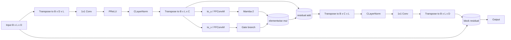

# Báo cáo kỹ thuật: Kế hoạch cải tiến MossFormer2 bằng Mamba-2 để triển khai với Codex

## 1. Mục tiêu

Mục tiêu của tài liệu này là chuyển toàn bộ hiểu biết đã phân tích thành một bản thiết kế kỹ thuật rõ ràng, đủ chi tiết để dùng trực tiếp với Codex nhằm triển khai một biến thể mới của **MossFormer2** trong đó **khối recurrent dựa trên Dilated FSMN** được thay bằng **Mamba-2**.

Mục tiêu cuối cùng không phải thay toàn bộ MossFormer2, mà là tạo ra một phiên bản lai hợp lý hơn về mặt kiến trúc:

- giữ nguyên **attention/local-global modeling branch** của MossFormer2,
- thay thế **recurrent memory branch** bằng **Mamba-2 / SSD-based block**,
- bảo toàn shape I/O, residual path, gating, normalization, và head tách nguồn,
- giảm rủi ro khi sửa code,
- dễ kiểm thử ablation.

Tên tạm cho biến thể này trong tài liệu:
**MossFormer2-Mamba** hoặc **MossFormer2-SSD**.

---

## 2. Kết luận thiết kế ở mức cao

### Kết luận chính

Phần nên thay thế trong MossFormer2 là:

- **Dilated FSMN block**
- cụ thể hơn trong code là:
  - `Gated_FSMN_dilated`
  - `Gated_FSMN_Block_Dilated`
  - và nơi các block này được gọi trong `MossformerBlock_GFSMN`

### Điều không nên thay

Không nên thay ở phiên bản đầu:

- `FLASH_ShareA_FFConvM`
- attention/local-global branch của MossFormer
- encoder/decoder
- mask estimation head
- output gating cuối cùng của separator

### Lý do

MossFormer2 là kiến trúc lai:

1. **MossFormer block** học phụ thuộc toàn cục và cục bộ bằng cơ chế attention hiệu quả.
2. **Dilated FSMN recurrent branch** bổ sung temporal memory tinh hơn.

Mamba-2 là một **state-space / selective recurrent block** mạnh hơn FSMN ở chỗ:

- có memory động theo input,
- long-range modeling tốt hơn,
- vẫn có chi phí tuyến tính theo độ dài chuỗi,
- phù hợp để đóng vai trò thay thế nhánh sequential memory.

Do đó, **thay recurrent branch bằng Mamba-2 là phương án tự nhiên hơn thay attention branch**.

---

## 3. Nguồn đã đọc và kiểm tra

### 3.1. Repo Mamba

Repo:
- https://github.com/state-spaces/mamba

Thông tin quan trọng từ README:

- Mamba block chính nằm ở:
  - `mamba_ssm/modules/mamba_simple.py`
- Mamba-2 block chính nằm ở:
  - `mamba_ssm/modules/mamba2.py`
  - bản đơn giản hơn:
    - `mamba_ssm/modules/mamba2_simple.py`
- API sử dụng:
  - `Mamba2(d_model, d_state, d_conv, expand)`
- README nêu rõ block này giữ nguyên shape đầu vào/đầu ra:
  - input: `[batch, length, dim]`
  - output: `[batch, length, dim]`
- README cũng nêu xấp xỉ số tham số:
  - `roughly 3 * expand * d_model^2 parameters`

### 3.2. Repo MossFormer2 trong ClearerVoice-Studio

Repo tree:
- http://github.com/modelscope/ClearerVoice-Studio/tree/main/train/speech_separation/models/mossformer2

Do hạn chế robots trên GitHub tree page, phần code đã đọc từ raw files:

- `mossformer2.py`
- `mossformer2_block.py`

Raw file đã kiểm tra:

- `mossformer2.py`
- `mossformer2_block.py`

Từ đây xác nhận được:

- separator chính là `MossFormer_MaskNet`
- backbone gọi `Computation_Block`
- `Computation_Block` dùng `MossFormerM`
- `MossFormerM` gọi `MossformerBlock_GFSMN`
- `MossformerBlock_GFSMN` chính là nơi attention branch và FSMN branch được ghép lại theo từng block

---

## 4. Kiến trúc gốc của MossFormer2 trong code

## 4.1. Luồng tổng thể trong `mossformer2.py`

Luồng model:

1. `Encoder`
2. `MossFormer_MaskNet`
3. nhân mask với encoded mixture
4. `Decoder`

Trong `MossFormer_MaskNet`:

- normalize đầu vào
- `conv1d_encoder`
- positional embedding
- `self.mdl = Computation_Block(...)`
- `conv1d_out`
- output gate + output projection
- `conv1_decoder`
- reshape thành `[spks, B, N, S]`

Như vậy phần cần sửa chủ yếu nằm trong:
**`Computation_Block` -> `MossFormerM` -> `MossformerBlock_GFSMN`**

---

## 4.2. Class quan trọng nhất: `MossformerBlock_GFSMN`

Trong `mossformer2_block.py`:

```python
self.fsmn = nn.ModuleList([Gated_FSMN_Block_Dilated(dim) for _ in range(depth)])
self.layers = nn.ModuleList([
    FLASH_ShareA_FFConvM(...)
    for _ in range(depth)
])
```

và `forward`:

```python
ii = 0
for flash in self.layers:
    x = flash(x, mask = mask)
    x = self.fsmn[ii](x)
    ii = ii + 1
return x
```

Nghĩa là mỗi tầng của MossFormer2 đang làm:

1. chạy **MossFormer attention block**
2. sau đó chạy **Dilated Gated FSMN block**

Đây chính là vị trí cần thay.

---

## 4.3. Block recurrent gốc: `Gated_FSMN_Block_Dilated`

Code rút lõi logic:

```python
self.conv1 = nn.Sequential(
    nn.Conv1d(dim, inner_channels, kernel_size=1),
    nn.PReLU(),
)
self.norm1 = CLayerNorm(inner_channels)
self.gated_fsmn = Gated_FSMN_dilated(...)
self.norm2 = CLayerNorm(inner_channels)
self.conv2 = nn.Conv1d(inner_channels, dim, kernel_size=1)
```

`forward`:

```python
conv1 = self.conv1(input.transpose(2,1))
norm1 = self.norm1(conv1)
seq_out = self.gated_fsmn(norm1.transpose(2,1))
norm2 = self.norm2(seq_out.transpose(2,1))
conv2 = self.conv2(norm2)
return conv2.transpose(2,1) + input
```

Đây là bản hiện thực của flowchart trong paper:

- bottleneck 1x1 conv + PReLU
- norm
- GCU/FSMN core
- norm
- output 1x1 conv
- residual

---

## 4.4. Lõi thật sự của recurrent branch: `Gated_FSMN_dilated`

Code logic:

```python
self.to_u = FFConvM(...)
self.to_v = FFConvM(...)
self.fsmn = UniDeepFsmn_dilated(...)
```

`forward`:

```python
input = x
x_u = self.to_u(x)
x_v = self.to_v(x)
x_u = self.fsmn(x_u)
x = x_v * x_u + input
return x
```

Ý nghĩa:

- nhánh `u` đi qua memory model
- nhánh `v` là nhánh gate
- sau đó nhân từng phần tử
- cộng residual

Nói cách khác, đây là **GCU + dilated FSMN memory**.

---

## 5. Chính xác phần nào phải thay

## 5.1. Mức thay thế khuyến nghị

Có 3 mức thay:

### Mức 1 — thay lõi nhỏ nhất
Thay riêng:
- `UniDeepFsmn_dilated`

Ưu điểm:
- ít sửa nhất

Nhược điểm:
- khó map clean sang API Mamba-2
- không phản ánh đúng cấu trúc gating mà ta muốn kiểm soát

### Mức 2 — thay block giữa
Thay:
- `Gated_FSMN_dilated`

Ưu điểm:
- thay đúng phần memory + gate
- hợp logic hơn mức 1

Nhược điểm:
- vẫn phải giữ `Gated_FSMN_Block_Dilated` ngoài cùng

### Mức 3 — thay block hợp lý nhất
Thay toàn bộ:
- `Gated_FSMN_Block_Dilated`
bằng
- `Gated_Mamba2_Block`

Đây là mức **khuyến nghị mạnh nhất**.

Ưu điểm:

- sạch code nhất
- dễ đọc
- dễ test
- giữ nguyên input/output shape
- giữ nguyên interface với `MossformerBlock_GFSMN`
- dễ rollback ablation

### Kết luận

Nên thay:
**`Gated_FSMN_Block_Dilated` -> `Gated_Mamba2_Block`**

và trong `MossformerBlock_GFSMN` đổi chỗ gọi block.

---

## 6. Kiến trúc đề xuất sau thay thế

## 6.1. Kiến trúc block mới

Block mới nên giữ triết lý của block cũ:

1. 1x1 conv bottleneck
2. PReLU
3. norm
4. gating branch tách làm `u` và `v`
5. `u` đi qua Mamba-2
6. `v` là gate branch
7. nhân `x_v * x_u`
8. cộng residual trong khối giữa
9. norm
10. 1x1 conv ra
11. residual với input block

### Sơ đồ logic



---

## 6.2. Tại sao vẫn giữ gating?

Vì `Gated_FSMN_dilated` gốc không phải chỉ là memory layer thuần, mà là:

- nhánh `u` học nội dung tuần tự
- nhánh `v` học cổng điều khiển
- nhân lại
- cộng residual

Nếu thay thẳng toàn bộ bằng `Mamba2(x)` thì:

- bạn mất cấu trúc inductive bias vốn có của MossFormer2
- khó đối chiếu ablation với bản gốc
- khó bảo đảm cải tiến là do Mamba-2 hay do thay cả block

Do đó nên giữ gate và thay đúng lõi memory.

---

## 7. Đề xuất code-level refactor

## 7.1. Mục tiêu refactor tối thiểu

Trong `mossformer2_block.py`:

- giữ nguyên `FLASH_ShareA_FFConvM`
- tạo thêm class mới:
  - `Gated_Mamba2`
  - `Gated_Mamba2_Block`
- sửa `MossformerBlock_GFSMN` để dùng block mới
- giữ lại block FSMN cũ để làm baseline hoặc option config

---

## 7.2. Thiết kế class đề xuất

### 7.2.1. `Gated_Mamba2`

Vai trò:
- tương đương `Gated_FSMN_dilated`
- giữ giao diện `forward(x)` với shape `[B, L, C]`

Pseudo-code:

```python
class Gated_Mamba2(nn.Module):
    def __init__(self, in_channels, hidden_size, d_state=64, d_conv=4, expand=2):
        super().__init__()
        self.to_u = FFConvM(
            dim_in=in_channels,
            dim_out=hidden_size,
            norm_klass=nn.LayerNorm,
            dropout=0.1,
        )
        self.to_v = FFConvM(
            dim_in=in_channels,
            dim_out=hidden_size,
            norm_klass=nn.LayerNorm,
            dropout=0.1,
        )
        self.mamba = Mamba2(
            d_model=hidden_size,
            d_state=d_state,
            d_conv=d_conv,
            expand=expand,
        )

    def forward(self, x):
        residual = x
        x_u = self.to_u(x)
        x_v = self.to_v(x)
        x_u = self.mamba(x_u)
        x = x_v * x_u + residual
        return x
```

### 7.2.2. `Gated_Mamba2_Block`

Vai trò:
- tương đương `Gated_FSMN_Block_Dilated`

Pseudo-code:

```python
class Gated_Mamba2_Block(nn.Module):
    def __init__(
        self,
        dim,
        inner_channels=256,
        d_state=64,
        d_conv=4,
        expand=2,
        norm_type='scalenorm',
    ):
        super().__init__()
        self.conv1 = nn.Sequential(
            nn.Conv1d(dim, inner_channels, kernel_size=1),
            nn.PReLU(),
        )
        self.norm1 = CLayerNorm(inner_channels)
        self.gated_mamba = Gated_Mamba2(
            in_channels=inner_channels,
            hidden_size=inner_channels,
            d_state=d_state,
            d_conv=d_conv,
            expand=expand,
        )
        self.norm2 = CLayerNorm(inner_channels)
        self.conv2 = nn.Conv1d(inner_channels, dim, kernel_size=1)

    def forward(self, input):
        conv1 = self.conv1(input.transpose(2, 1))
        norm1 = self.norm1(conv1)
        seq_out = self.gated_mamba(norm1.transpose(2, 1))
        norm2 = self.norm2(seq_out.transpose(2, 1))
        conv2 = self.conv2(norm2)
        return conv2.transpose(2, 1) + input
```

---

## 7.3. Sửa `MossformerBlock_GFSMN`

### Bản gốc

```python
self.fsmn = nn.ModuleList([Gated_FSMN_Block_Dilated(dim) for _ in range(depth)])
...
for flash in self.layers:
    x = flash(x, mask = mask)
    x = self.fsmn[ii](x)
```

### Bản đề xuất

```python
self.ssm = nn.ModuleList([
    Gated_Mamba2_Block(
        dim=dim,
        inner_channels=256,
        d_state=64,
        d_conv=4,
        expand=2,
    )
    for _ in range(depth)
])

for i, flash in enumerate(self.layers):
    x = flash(x, mask=mask)
    x = self.ssm[i](x)
return x
```

---

## 8. Nên thêm config như thế nào

Để Codex triển khai dễ hơn, không nên hard-code thẳng. Nên thêm config để bật tắt giữa FSMN và Mamba-2.

### Đề xuất config

```python
recurrent_type: "fsmn" | "mamba2"
mamba_d_state: 64
mamba_d_conv: 4
mamba_expand: 2
recurrent_inner_channels: 256
```

### Triển khai gợi ý

Trong `MossformerBlock_GFSMN.__init__`:

```python
if recurrent_type == "fsmn":
    self.recurrent = nn.ModuleList([
        Gated_FSMN_Block_Dilated(dim, inner_channels=recurrent_inner_channels)
        for _ in range(depth)
    ])
elif recurrent_type == "mamba2":
    self.recurrent = nn.ModuleList([
        Gated_Mamba2_Block(
            dim,
            inner_channels=recurrent_inner_channels,
            d_state=mamba_d_state,
            d_conv=mamba_d_conv,
            expand=mamba_expand,
        )
        for _ in range(depth)
    ])
else:
    raise ValueError(...)
```

`forward`:

```python
for i, flash in enumerate(self.layers):
    x = flash(x, mask=mask)
    x = self.recurrent[i](x)
```

Lợi ích:

- chạy baseline FSMN và Mamba-2 chung codebase
- ablation dễ
- rollback dễ
- Codex dễ kiểm soát phạm vi sửa

---

## 9. Mapping shape để tránh lỗi khi triển khai

Đây là phần rất quan trọng để Codex không làm hỏng shape.

## 9.1. Shape trong MossFormer2 hiện tại

Trong `FLASH_ShareA_FFConvM` và `MossformerBlock_GFSMN`, dữ liệu đi theo dạng:

- `x`: `[B, L, D]`

Trong `Gated_FSMN_Block_Dilated`:

- đầu vào: `[B, L, D]`
- `transpose(2,1)` -> `[B, D, L]`
- `conv1` và `conv2` dùng `Conv1d`, nên yêu cầu `[B, C, T]`
- trước khi vào `Gated_FSMN_dilated`, lại transpose về `[B, L, C]`

## 9.2. Shape kỳ vọng của Mamba-2

Theo repo Mamba:

- input: `[B, L, D]`
- output: `[B, L, D]`

Điều này cực kỳ thuận lợi vì block Mamba-2 có thể đặt đúng chỗ `self.fsmn(...)` đang dùng.

## 9.3. Quy tắc shape cần giữ

Trong block mới:

- tất cả trước `conv1` và sau `conv2` giữ y nguyên như block cũ
- chỉ thay phần giữa `seq_out = self.gated_fsmn(...)` bằng `self.gated_mamba(...)`
- không thay order transpose ngoài phần giữa

### Checklist shape

- block input: `[B, L, D]`
- after conv1+norm1: `[B, C, L]`
- before Mamba-2: `[B, L, C]`
- after Mamba-2: `[B, L, C]`
- before conv2: `[B, C, L]`
- block output: `[B, L, D]`

---

## 10. Ước lượng thay đổi tham số

## 10.1. Bản chất thay đổi

FSMN có tham số chủ yếu từ:

- linear / conv projection
- memory conv/filter

Mamba-2 có tham số chủ yếu từ:

- input projection
- selective state-space parameters
- output projection
- local conv trong Mamba

README repo Mamba cho biết:
**Mamba/Mamba-2 dùng xấp xỉ `3 * expand * d_model^2` tham số cho mỗi module**.

Với `expand=2`:
- khoảng `6 * d_model^2`

Điều này cho thấy nếu thay phần recurrent của MossFormer2 bằng Mamba-2 thì:

- số tham số khối recurrent tăng
- nhưng không nhất thiết tổng model tăng quá nhiều, vì chỉ thay một nhánh trong separator

## 10.2. Kỳ vọng thực tế

Nếu chỉ thay recurrent block:

- tổng params toàn model có thể tăng khoảng **5% đến 20%**
- tùy `inner_channels`, `d_state`, `expand`, số layer

## 10.3. Kỳ vọng compute

Mamba-2 vẫn tuyến tính theo chuỗi, nhưng:

- có thêm projections
- có scan/SSD
- có local conv

Nên tốc độ thực tế có thể:
- nhanh hơn attention trên chuỗi dài,
- nhưng chưa chắc nhanh hơn FSMN đơn giản ở chuỗi ngắn.

Do đó, mục tiêu chính của thay thế này là:
- **chất lượng tách nguồn**
- **khả năng modeling temporal dependencies**
hơn là giảm params.

---

## 11. Kế hoạch triển khai với Codex

Đây là phần quan trọng nhất cho thực thi.

## 11.1. Mục tiêu triển khai giai đoạn 1

Mục tiêu giai đoạn 1 là tạo một patch nhỏ, chạy được, không cần tối ưu nhất.

### Yêu cầu

1. không làm hỏng baseline FSMN cũ
2. có thể chọn `recurrent_type=fsmn|mamba2`
3. shape I/O giữ nguyên
4. chạy được forward pass
5. đếm params được
6. train loop không phải sửa lớn

---

## 11.2. Các bước Codex nên làm

### Bước 1: thêm dependency

Cài:
```bash
pip install mamba-ssm
pip install causal-conv1d>=1.4.0
```

Nếu môi trường không build được:
- fallback dùng implementation tối giản hoặc wrapper stub
- nhưng ưu tiên package chính thức

### Bước 2: tạo block mới

Trong `mossformer2_block.py`:

- import:
  ```python
  from mamba_ssm import Mamba2
  ```
- thêm:
  - `Gated_Mamba2`
  - `Gated_Mamba2_Block`

### Bước 3: thêm config

Trong args/config:

- `recurrent_type`
- `mamba_d_state`
- `mamba_d_conv`
- `mamba_expand`
- `recurrent_inner_channels`

### Bước 4: sửa constructor

Trong `MossFormerM` hoặc sâu hơn trong `MossformerBlock_GFSMN`:

- truyền các config này vào block backbone

### Bước 5: đổi `self.fsmn` thành block chung

Ví dụ:
```python
self.recurrent = nn.ModuleList(...)
```

### Bước 6: kiểm thử shape

Viết test:
- input giả `[2, 320, dim]`
- output shape phải bằng input shape

### Bước 7: kiểm thử end-to-end

Test model separator:
- input waveform `[B, T]`
- output list length = `num_spks`
- mỗi tensor `[B, T]`

### Bước 8: đếm params

In:
- baseline FSMN
- Mamba2 variant

### Bước 9: benchmark forward time

So sánh:
- batch nhỏ
- độ dài ngắn
- độ dài dài

---

## 11.3. Prompt mẫu cho Codex

Có thể dùng prompt kiểu này:

```text
Refactor the MossFormer2 implementation so that the recurrent FSMN branch can be replaced by a Mamba-2 block while preserving the original interface and tensor shapes.

Requirements:
1. Keep the original FSMN implementation for backward compatibility.
2. Add a config flag recurrent_type with values "fsmn" and "mamba2".
3. Implement a new Gated_Mamba2 block analogous to Gated_FSMN_Block_Dilated.
4. Preserve the bottleneck 1x1 conv, PReLU, CLayerNorm, gating structure, output 1x1 conv, and residual connections.
5. Use Mamba2 from mamba_ssm with input/output shape [B, L, D].
6. Make minimal invasive changes to MossformerBlock_GFSMN.
7. Add a small shape test and a parameter count utility.
8. Do not modify encoder, decoder, or the MossFormer attention block.
```

---

## 12. Những rủi ro kỹ thuật cần báo trước cho Codex

## 12.1. Rủi ro dependency

`mamba-ssm` có thể yêu cầu:

- CUDA phù hợp
- compiler phù hợp
- PyTorch version phù hợp

Do đó nên cho Codex:

- ưu tiên import thật
- nếu import lỗi, báo lỗi rõ
- không âm thầm fallback sang block giả mà không thông báo

## 12.2. Rủi ro precision / stability

README Mamba nhấn mạnh SSM nhạy với precision và dynamics. Nên:

- ưu tiên train bằng AMP chuẩn PyTorch
- tránh tự ý zero-init bias nếu ảnh hưởng init của Mamba
- nên có test loss finite sau vài bước

## 12.3. Rủi ro shape/transposes

Dễ sai nhất là:

- nhầm `[B, L, D]` với `[B, D, L]`
- đưa tensor `[B, D, L]` thẳng vào Mamba-2
- quên transpose sau `CLayerNorm`

## 12.4. Rủi ro over-replacement

Không nên để Codex:

- thay `FLASH_ShareA_FFConvM`
- thay toàn bộ `MossformerBlock`
- bỏ residual cũ
- bỏ output head

Vì như vậy không còn là “MossFormer2 + Mamba-2” mà thành mô hình khác.

---

## 13. Đề xuất ablation

Để biết cải tiến đến từ đâu, nên chạy 4 cấu hình.

### A. Baseline
- MossFormer2 gốc
- recurrent_type=`fsmn`

### B. Core replacement
- MossFormer2-Mamba
- recurrent_type=`mamba2`
- giữ nguyên gate + bottleneck + output

### C. Mamba-only simplified recurrent
- bỏ `to_v` hoặc giản lược gate
- dùng `x + Mamba2(x)`
- chỉ để kiểm tra gate có cần không

### D. Hybrid depth study
- chỉ thay nửa số recurrent blocks cuối
- hoặc nửa số block đầu

Mục tiêu:
- xác định vị trí Mamba-2 đem lại lợi ích lớn nhất

---

## 14. Tiêu chí đánh giá

Với speech separation, nên theo dõi tối thiểu:

- SI-SDR / SI-SDRi
- SDR / SDRi nếu pipeline có
- tốc độ huấn luyện
- GPU memory
- tham số toàn model
- thời gian inference

Nếu task là causal/streaming:
- kiểm tra độ trễ
- kiểm tra chunk behavior

---

## 15. Khuyến nghị hyperparameter đầu tiên

Để giảm rủi ro khi bắt đầu, nên dùng:

```yaml
recurrent_type: mamba2
recurrent_inner_channels: 256
mamba_d_state: 64
mamba_d_conv: 4
mamba_expand: 2
```

Lý do:

- `d_state=64` là mức phổ biến trong repo Mamba
- `d_conv=4` khớp API gốc
- `expand=2` là setting mặc định phổ biến
- giữ `inner_channels=256` giống block cũ giúp so sánh công bằng hơn

Sau khi chạy ổn, mới thử:

- `d_state=128`
- `expand=1.5` hoặc `2`
- thay `inner_channels`

---

## 16. Đề xuất cấu trúc file sau khi sửa

### Phương án tối thiểu
Giữ nguyên file:

- `mossformer2_block.py`

thêm trực tiếp:
- `Gated_Mamba2`
- `Gated_Mamba2_Block`

### Phương án sạch hơn
Tạo file mới:

- `mamba_recurrent.py`

và import vào `mossformer2_block.py`

Ưu điểm:
- gọn
- tách logic SSM khỏi block attention
- dễ review PR hơn

Khuyến nghị:
- nếu cần patch nhanh: sửa trực tiếp 1 file
- nếu muốn maintain lâu dài: tách file

---

## 17. Ví dụ patch tối thiểu

```python
# new import
from mamba_ssm import Mamba2

class Gated_Mamba2(nn.Module):
    def __init__(self, in_channels, hidden_size, d_state=64, d_conv=4, expand=2):
        super().__init__()
        self.to_u = FFConvM(
            dim_in=in_channels,
            dim_out=hidden_size,
            norm_klass=nn.LayerNorm,
            dropout=0.1,
        )
        self.to_v = FFConvM(
            dim_in=in_channels,
            dim_out=hidden_size,
            norm_klass=nn.LayerNorm,
            dropout=0.1,
        )
        self.mamba = Mamba2(
            d_model=hidden_size,
            d_state=d_state,
            d_conv=d_conv,
            expand=expand,
        )

    def forward(self, x):
        residual = x
        x_u = self.to_u(x)
        x_v = self.to_v(x)
        x_u = self.mamba(x_u)
        return x_v * x_u + residual


class Gated_Mamba2_Block(nn.Module):
    def __init__(self, dim, inner_channels=256, d_state=64, d_conv=4, expand=2):
        super().__init__()
        self.conv1 = nn.Sequential(
            nn.Conv1d(dim, inner_channels, kernel_size=1),
            nn.PReLU(),
        )
        self.norm1 = CLayerNorm(inner_channels)
        self.gated_mamba = Gated_Mamba2(
            in_channels=inner_channels,
            hidden_size=inner_channels,
            d_state=d_state,
            d_conv=d_conv,
            expand=expand,
        )
        self.norm2 = CLayerNorm(inner_channels)
        self.conv2 = nn.Conv1d(inner_channels, dim, kernel_size=1)

    def forward(self, input):
        conv1 = self.conv1(input.transpose(2, 1))
        norm1 = self.norm1(conv1)
        seq_out = self.gated_mamba(norm1.transpose(2, 1))
        norm2 = self.norm2(seq_out.transpose(2, 1))
        conv2 = self.conv2(norm2)
        return conv2.transpose(2, 1) + input
```

và trong `MossformerBlock_GFSMN`:

```python
self.recurrent = nn.ModuleList([
    Gated_Mamba2_Block(dim) for _ in range(depth)
])

for i, flash in enumerate(self.layers):
    x = flash(x, mask=mask)
    x = self.recurrent[i](x)
```

---

## 18. Kiểm thử bắt buộc sau khi sửa

## 18.1. Unit test block

```python
x = torch.randn(2, 100, 512).cuda()
blk = Gated_Mamba2_Block(dim=512, inner_channels=256).cuda()
y = blk(x)
assert y.shape == x.shape
assert torch.isfinite(y).all()
```

## 18.2. Unit test backbone

```python
x = torch.randn(2, 100, 512).cuda()
net = MossformerBlock_GFSMN(dim=512, depth=4, recurrent_type="mamba2").cuda()
y = net(x)
assert y.shape == x.shape
```

## 18.3. End-to-end separator test

```python
wav = torch.randn(2, 32000).cuda()
model = MossFormer2_SS(args).cuda()
outs = model(wav)
assert isinstance(outs, list)
assert len(outs) == args.num_spks
for o in outs:
    assert o.shape == wav.shape
```

## 18.4. Parameter count test

```python
sum(p.numel() for p in model.parameters() if p.requires_grad)
```

So sánh:
- baseline FSMN
- Mamba-2 variant

---

## 19. Những gì Codex không nên tự ý làm

- không đổi tên class public trừ khi cần
- không sửa encoder/decoder
- không thay `FLASH_ShareA_FFConvM`
- không đổi thứ tự normalize/residual nếu không có lý do rõ
- không bỏ `CLayerNorm`
- không đổi shape contract của separator output
- không thay toàn bộ repo sang Mamba

---

## 20. Kết luận cuối cùng

### Chốt ý tưởng triển khai

Biến thể hợp lý nhất để cải tiến MossFormer2 bằng Mamba-2 là:

> **giữ nguyên MossFormer attention branch, thay Dilated FSMN recurrent branch bằng một Gated Mamba-2 block có cùng giao diện và cùng topology residual/gating.**

### Chỗ sửa chính xác trong code

File:
- `train/speech_separation/models/mossformer2/mossformer2_block.py`

Class cần thay ở mức khuyến nghị:
- `Gated_FSMN_Block_Dilated` -> `Gated_Mamba2_Block`

Nơi cần sửa để gọi block mới:
- `MossformerBlock_GFSMN`

### Mức thay tối ưu

- ít phá vỡ code cũ
- giữ logic của paper
- dễ viết ablation
- phù hợp để Codex thực thi

### Câu lệnh tư duy chuẩn cho bản triển khai

> “Replace the dilated FSMN-based recurrent block in MossFormer2 with a Mamba-2-based gated recurrent block, while preserving the original attention branch, block-level residual structure, normalization pattern, and input/output tensor shapes.”

---

## 21. Tài liệu tham khảo

1. Gu, A., & Dao, T. (2023). *Mamba: Linear-Time Sequence Modeling with Selective State Spaces*. arXiv preprint arXiv:2312.00752. https://arxiv.org/abs/2312.00752

2. Dao, T., & Gu, A. (2024). *Transformers are SSMs: Generalized Models and Efficient Algorithms Through Structured State Space Duality*. ICML 2024. https://arxiv.org/abs/2405.21060

3. Zhao, S., Ma, Y., Ni, C., Zhang, C., & Wang, H. (2024). *MossFormer2: Combining Transformer and RNN-free Recurrent Network for Enhanced Time-domain Monaural Speech Separation*. ICASSP 2024. https://arxiv.org/pdf/2312.11825

4. state-spaces. (2025). *Mamba GitHub Repository*. https://github.com/state-spaces/mamba

5. modelscope. (2025). *ClearerVoice-Studio MossFormer2 implementation*. http://github.com/modelscope/ClearerVoice-Studio/tree/main/train/speech_separation/models/mossformer2

6. ClearerVoice-Studio raw source. *mossformer2.py*. https://raw.githubusercontent.com/modelscope/ClearerVoice-Studio/main/train/speech_separation/models/mossformer2/mossformer2.py

7. ClearerVoice-Studio raw source. *mossformer2_block.py*. https://raw.githubusercontent.com/modelscope/ClearerVoice-Studio/main/train/speech_separation/models/mossformer2/mossformer2_block.py

8. Qu, H., Ning, L., An, R., Fan, W., Derr, T., Liu, H., & Xu, X. (2024). *A Survey of Mamba*. arXiv preprint arXiv:2408.01129. https://arxiv.org/abs/2408.01129

9. Xu, R., Yang, S., Wang, Y., Cai, Y., Du, B., & Chen, H. (2024). *Visual Mamba: A Survey and New Outlooks*. arXiv preprint arXiv:2404.18861. https://arxiv.org/abs/2404.18861

10. Wang, Z., & Luo, Z. (2025). *Speech Separation Using Advanced Deep Neural Network Methods: A Recent Survey*. Big Data and Cognitive Computing, 9(11), 289. https://www.mdpi.com/2504-2289/9/11/289
